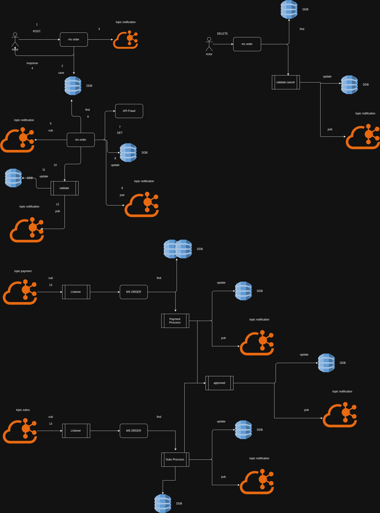

markdown
# Acme Insurance Order Service

This project is a Spring Boot microservice for managing insurance policy orders, including creation, retrieval, and cancellation of policy requests. 
the microsservice is built using Java 17 and follows a clean architecture approach with reactive programming principles using Project Reactor.

## Features

- Create, retrieve, and cancel insurance policy requests
- Reactive programming with Project Reactor (`Mono`, `Flux`)
- Clean architecture with use cases and mappers
- Enum-based status management
- Unit tests with JUnit 5 and Mockito
- Infrastructure Kafka integration for event pub/sub
- Avro schema for message serialization
- Database integration is a dynamoDB for persistence
- Feign client for external service calls
- Docker compose for local development
- GraalVM native image support
- Automate mensaging in kafka with  shell script


## Build & Run

This project uses Maven.

```bash
docker-compose up -d
```
```bash
mvn clean install 
```
or to build the native image
```bash
mvn spring-boot:run
```

go to src/main/resources/script have a script to automate the messaging in kafka.

on linux or mac you can run the script with the following command:
```bash
chmod +x src/main/resources/script/script.sh
```
```bash
./script.sh policy_id
```
## System Design



[System Design](https://viewer.diagrams.net/?tags=%7B%7D&lightbox=1&highlight=0000ff&edit=_blank&layers=1&nav=1&dark=auto#G1xyEYAhJSnZi3er-9BIESgm9ztVenD_Y7)